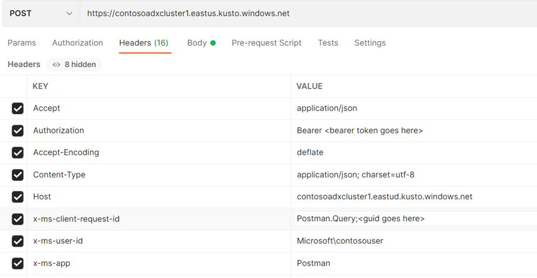

# Introduction
There are often evaluation scenarios in which query performance of Azure Data Explorer needs to be evaluated. The following article describes testing performance of ADX by sending concurrent/sequential queries to ADX REST API. There are many tools to perform load test. We will look at configuration of 2 such tools - Grafana k6 or JMeter to execute load tests.
## Please keep in mind:
•	Size your ADX cluster appropriately to achieve an optimal price/performance ratio. Running load test on undersized cluster will mostly result in high query response times. 

•	If you know the estimated queries/second that you intend to send to your ADX cluster, then configure the load test according to that. For example, 1 query/second means 86400 queries/day.

•	ADX cluster will not scale out when you run load test for few minutes. ADX scales out on sustained CPU usage, query and ingestion operations and not based on few load tests.

•	Running load tests for longer periods can generate unnecessary load on the cluster that can potentially trigger a scale out event and additional costs. Configure your load tests appropriately. Typically, running a load test for 5 mins with 20 virtual users can generate 7 requests/second which is equivalent to sending nearly 200k queries to ADX in an 8-hour business day.

•	Load test is synthetic in nature meaning, all users from the same location are sending same requests for a defined duration. Your real-life scenario will typically have users across many locations, sending different requests (queries) to ADX cluster. So, please take the load test results into account with this perspective in mind.
## Pre-requisites:
•	Authorization to create a service principal in your Azure Active Directory and grant “Reader” role to this Service Principal in your Azure Data Explorer database (Steps covered below).

•	Any API unit testing tool to retrieve bearer token to authenticate ADX REST API requests. We used POSTMAN in this example.

## Steps to retrieve Authentication token (Bearer):
### Step 1: Create Service Principal
Use the following link to follow the steps for creating Service Principal. Copy the AppID/ClientID, TenantID, Secret when creating this service principal. You will need this data futher.
https://docs.microsoft.com/en-us/azure/data-explorer/grafana#create-a-service-principal
### Step 2: Grant “Reader” role to the Service Principal
Use the following link to grant “Reader” role to the service principal that you created in Step 1.
https://docs.microsoft.com/en-us/azure/data-explorer/grafana#add-the-service-principal-to-the-viewers-role
### Step 3: Retrieve Bearer token
For retrieving bearer token, create a POST request to https://login.microsoftonline.com/<tenant-id>/oauth2/v2.0/token?
Provide the following key-value pairs in the body as shown in the screen shot below:
|Key |	Value|	Guidance|
|-----|-----|-----|
|grant_type	|client_credentials|	Use it as-is|
|client_id|	\<app-id> |	Use from Step 1|
|client_secret	|\<client-secret>|	Use from Step 1
|scope	|For ADX standalone clusters, https://\<cluster-name>.\<region-name>.kusto.windows.net/.default ;                   For Synapse Data Explorer pools, https://\<dx-pool-name>.kusto.azuresynapse.net/.default |	Copy it from Azure Data Explorer Cluster or Synapse Data Explorer Pool overview page|

 
 

On sending this POST request using POSTMAN, you will receive an “access_token” in the response body as shown in the screen shot below. Copy this token for further use.

  

### Step 4: Test ADX Query REST API response using any API testing tool
Build your ADX cluster’s Query REST API in the following format:
\<cluster-uri>/v2/rest/query
Include the following parameters in the header:
|Key	|Value	|Guidance|
|---|---|---|
|Accept|	application/json|	Use it as-is|
|Authorization| 	Bearer \<bearer-token>	Retrieved in Step 3|
|Accept-Encoding|	deflate|	Use it as-is|
|Content-Type|	application/json; charset=utf-8|	Use it as-is|
|Host|	\<cluster-name>.\<region>.kusto.windows.net|	As retrieved in Step 3|
x-ms-client-request-id|	Postman.Query;\<generate-uuid>|	Generate a random UUID|
x-ms-user-id|	\<your-user-name>	|Provide one as this will be useful when tracing and RCAing query performance|
x-ms-app|	Postman	|Provide one as this will be useful when tracing and RCAing query performance|

 

In the body of this POST request, you will need to include the Kusto query that you want to send to the cluster. For building this request body, you will need the following:

**Database Name** – referred to as ‘db’ in the request body.

**Kusto Query**- Included in “ ” as shown in the example below. It is recommended to test this query in ADX Web Explorer or Kusto Explorer before pasting it in the request body. Also, if you are using “” in your query for strings, then you will need to replace “” with \’ \’. For example, “sampleString” -> ‘sampleString’ or \’sampleString\’

 

 
On sending this POST request, you will receive a JSON response with the data you have requested in the query.

## Next Steps
We can now move on to testing the performance of ADX using the 2 testing tools we have chosen
* [Grafana K6](load-test-adx-using-grafana-k6.md) -  Steps to configure k6, perform load test and intepret the results
* [JMeter](load-test-adx-using-jmeter.md) - Steps to configure k6, perform load test and intepret the results

