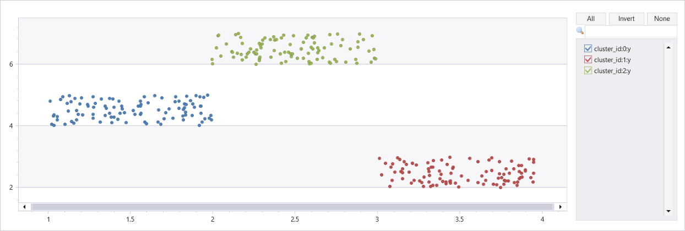

# dbscan_fl()

::: zone pivot="azuredataexplorer, fabric"

The function `dbscan_fl()` is a [UDF (user-defined function)](../query/functions/user-defined-functions.md) that clusterizes a dataset using the [DBSCAN algorithm](https://en.wikipedia.org/wiki/DBSCAN).

[!INCLUDE [python-zone-pivot-fabric](../../includes/python-zone-pivot-fabric.md)]

## Syntax

`T | invoke dbscan_fl(`*features*`,` *cluster_col*`,` *epsilon*`,` *min_samples*`,` *metric*`,` *metric_params*`)`

[!INCLUDE [syntax-conventions-note](../../includes/syntax-conventions-note.md)]

## Parameters

|Name|Type|Required|Description|
|--|--|--|--|
|*features*| `dynamic` | :heavy_check_mark:|An array containing the names of the features columns to use for clustering.|
|*cluster_col*| `string` | :heavy_check_mark:|The name of the column to store the output cluster ID for each record.|
|*epsilon*| `real` | :heavy_check_mark:|The maximum distance between two samples to be considered as neighbors.|
|*min_samples*| `int` | |The number of samples in a neighborhood for a point to be considered as a core point.|
|*metric*| `string` | |The metric to use when calculating distance between points.|
|*metric_params*| `dynamic` | |Additional keyword arguments for the metric function.|

* For detailed description of the parameters see [DBSCAN documentation](https://scikit-learn.org/stable/modules/generated/sklearn.cluster.DBSCAN.html)
* For the list of metrics see [distance computations](https://docs.scipy.org/doc/scipy/reference/spatial.distance.html)

## Function definition

You can define the function by either embedding its code as a query-defined function, or creating it as a stored function in your database, as follows:

### [Query-defined](#tab/query-defined)

Define the function using the following [let statement](../query/let-statement.md). No permissions are required.

> [!IMPORTANT]
> A [let statement](../query/let-statement.md) can't run on its own. It must be followed by a [tabular expression statement](../query/tabular-expression-statements.md). To run a working example of `kmeans_fl()`, see [Examples](#examples).

~~~kusto
let dbscan_fl=(tbl:(*), features:dynamic, cluster_col:string, epsilon:double, min_samples:int=10,
                       metric:string='minkowski', metric_params:dynamic=dynamic({'p': 2}))
{
    let kwargs = bag_pack('features', features, 'cluster_col', cluster_col, 'epsilon', epsilon, 'min_samples', min_samples,
                          'metric', metric, 'metric_params', metric_params);
    let code = ```if 1:

        from sklearn.cluster import DBSCAN
        from sklearn.preprocessing import StandardScaler

        features = kargs["features"]
        cluster_col = kargs["cluster_col"]
        epsilon = kargs["epsilon"]
        min_samples = kargs["min_samples"]
        metric = kargs["metric"]
        metric_params = kargs["metric_params"]

        df1 = df[features]
        mat = df1.values
        
        # Scale the dataframe
        scaler = StandardScaler()
        mat = scaler.fit_transform(mat)

        # see https://docs.scipy.org/doc/scipy/reference/spatial.distance.html for the various distance metrics

        dbscan = DBSCAN(eps=epsilon, min_samples=min_samples, metric=metric, metric_params=metric_params) # 'minkowski', 'chebyshev'
        labels = dbscan.fit_predict(mat)

        result = df
        result[cluster_col] = labels
    ```;
    tbl
    | evaluate python(typeof(*),code, kwargs)
};
// Write your query to use the function here.
~~~

### [Stored](#tab/stored)

Define the stored function once using the following [`.create function`](../management/create-function.md). [Database User permissions](../management/access-control/role-based-access-control.md) are required.

> [!IMPORTANT]
> You must run this code to create the function before you can use the function as shown in the [Examples](#examples).

~~~kusto
.create-or-alter function with (folder = "Packages\\ML", docstring = "DBSCAN clustering")
dbscan_fl(tbl:(*), features:dynamic, cluster_col:string, epsilon:double, min_samples:int=10,
                       metric:string='minkowski', metric_params:dynamic=dynamic({'p': 2}))
{
    let kwargs = bag_pack('features', features, 'cluster_col', cluster_col, 'epsilon', epsilon, 'min_samples', min_samples,
                          'metric', metric, 'metric_params', metric_params);
    let code = ```if 1:

        from sklearn.cluster import DBSCAN
        from sklearn.preprocessing import StandardScaler

        features = kargs["features"]
        cluster_col = kargs["cluster_col"]
        epsilon = kargs["epsilon"]
        min_samples = kargs["min_samples"]
        metric = kargs["metric"]
        metric_params = kargs["metric_params"]

        df1 = df[features]
        mat = df1.values
        
        # Scale the dataframe
        scaler = StandardScaler()
        mat = scaler.fit_transform(mat)

        # see https://docs.scipy.org/doc/scipy/reference/spatial.distance.html for the various distance metrics

        dbscan = DBSCAN(eps=epsilon, min_samples=min_samples, metric=metric, metric_params=metric_params) # 'minkowski', 'chebyshev'
        labels = dbscan.fit_predict(mat)

        result = df
        result[cluster_col] = labels
    ```;
    tbl
    | evaluate python(typeof(*),code, kwargs)
}
~~~

---

## Example

The following example use the [invoke operator](../query/invoke-operator.md) to run the function.

### Clustering of artificial dataset with 3 clusters

### [Query-defined](#tab/query-defined)

To use a query-defined function, invoke it after the embedded function definition.

~~~kusto
let dbscan_fl=(tbl:(*), features:dynamic, cluster_col:string, epsilon:double, min_samples:int=10,
                       metric:string='minkowski', metric_params:dynamic=dynamic({'p': 2}))
{
    let kwargs = bag_pack('features', features, 'cluster_col', cluster_col, 'epsilon', epsilon, 'min_samples', min_samples,
                          'metric', metric, 'metric_params', metric_params);
    let code = ```if 1:

        from sklearn.cluster import DBSCAN
        from sklearn.preprocessing import StandardScaler

        features = kargs["features"]
        cluster_col = kargs["cluster_col"]
        epsilon = kargs["epsilon"]
        min_samples = kargs["min_samples"]
        metric = kargs["metric"]
        metric_params = kargs["metric_params"]

        df1 = df[features]
        mat = df1.values
        
        # Scale the dataframe
        scaler = StandardScaler()
        mat = scaler.fit_transform(mat)

        # see https://docs.scipy.org/doc/scipy/reference/spatial.distance.html for the various distance metrics

        dbscan = DBSCAN(eps=epsilon, min_samples=min_samples, metric=metric, metric_params=metric_params) # 'minkowski', 'chebyshev'
        labels = dbscan.fit_predict(mat)

        result = df
        result[cluster_col] = labels
    ```;
    tbl
    | evaluate python(typeof(*),code, kwargs)
};
union 
(range x from 1 to 100 step 1 | extend x=rand()+3, y=rand()+2),
(range x from 101 to 200 step 1 | extend x=rand()+1, y=rand()+4),
(range x from 201 to 300 step 1 | extend x=rand()+2, y=rand()+6)
| extend cluster_id=int(null)
| invoke dbscan_fl(pack_array("x", "y"), "cluster_id", epsilon=0.6, min_samples=4, metric_params=dynamic({'p':2}))
| render scatterchart with(series=cluster_id)
~~~

### [Stored](#tab/stored)

> [!IMPORTANT]
> For this example to run successfully, you must first run the [Function definition](#function-definition) code to store the function.

```kusto
union 
(range x from 1 to 100 step 1 | extend x=rand()+3, y=rand()+2),
(range x from 101 to 200 step 1 | extend x=rand()+1, y=rand()+4),
(range x from 201 to 300 step 1 | extend x=rand()+2, y=rand()+6)
| extend cluster_id=int(null)
| invoke dbscan_fl(pack_array("x", "y"), "cluster_id", epsilon=0.6, min_samples=4, metric_params=dynamic({'p':2}))
| render scatterchart with(series=cluster_id)
```

---



::: zone-end

::: zone pivot="azuremonitor"

This feature isn't supported.

::: zone-end
